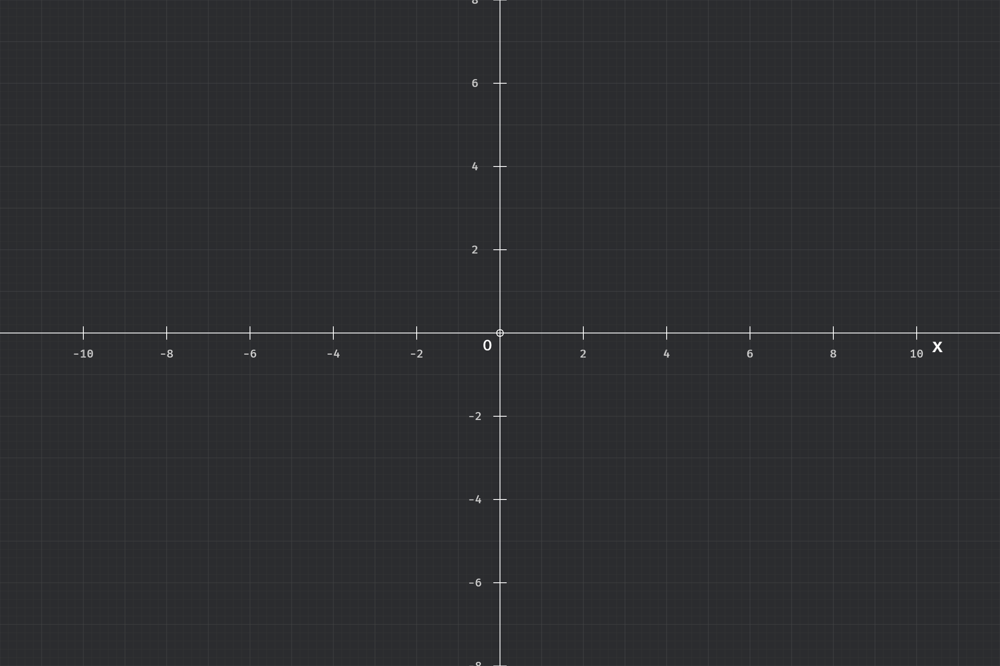

# RIM - Mathematical Visualization Tool

[中文](README_zh.md) | **English**

A high-performance mathematical visualization tool built with Bevy game engine, inspired by Manim.



## 🎯 Project Goals

Create a high-performance interactive mathematical visualization tool that combines:
- **Manim's** excellent mathematical animation design philosophy
- **Bevy's** modern game engine architecture and high-performance rendering

## ✨ Current Features

- ✅ **Coordinate System**: Complete axes and grid system with customizable ranges
- ✅ **Interactive Controls**: Mouse wheel zoom, keyboard shortcuts
- ✅ **Visibility Management**: Show/hide axes and grid independently  
- ✅ **Export System**: PNG screenshot export with timestamp naming
- ✅ **UI Control Panel**: Comprehensive sidebar with collapsible sections
- ✅ **Basic Shapes**: Circle creation with position, radius, and color controls
- 🚧 **Animation System**: Foundation laid, implementation in progress
- 📋 **Function Graphs**: Mathematical function plotting (planned)
- 📋 **Advanced Shapes**: Lines, rectangles, and complex geometries (planned)

## 🎮 Usage

### Basic Operations
```rust
// The application starts with a coordinate system
// Use the left sidebar to control various aspects:

// Coordinate System
- Show/Hide axes and grid
- View current zoom level and coordinate ranges
- Reset coordinate system to default state
- Mathematical coordinate system: Origin (0,0) at screen center, X-axis positive to the right, Y-axis positive upward

// Basic Shapes - Circles
- Set position (X, Y coordinates)
- Adjust radius (0.1 to 5.0 units)
- Choose stroke color with color picker
- Toggle fill option for solid circles
- Add multiple circles with automatic positioning
- Clear all circles at once

// Export Options
- Take PNG screenshots with timestamp naming
- Screenshots saved to screenshots/ directory
```

### Keyboard Shortcuts
| Key | Action |
|-----|--------|
| `F1` | Toggle UI visibility |
| `A` | Toggle axes visibility |
| `G` | Toggle grid visibility |
| `S` | Take screenshot |
| `Mouse Wheel` | Zoom in/out |

### Circle Controls
The **Basic Shapes** panel provides comprehensive circle management:

- **Position Control**: Set X and Y coordinates with drag values (-10.0 to 10.0)
- **Radius Control**: Adjust circle size with drag value (0.1 to 5.0)
- **Color Selection**: RGB color picker for stroke color
- **Fill Option**: Toggle to show filled circles with transparency
- **Resolution Control**: Automatic or manual circle precision adjustment (8-256 segments)
- **Smart Positioning**: Automatic position adjustment for new circles
- **Batch Operations**: Clear all circles with one click

### Export Features
- **PNG Screenshots**: High-quality image export
- **Automatic Naming**: Timestamp-based filenames
- **Directory Management**: Auto-creation of screenshots folder
- **User Feedback**: Status messages and operation confirmations

## 🚀 Quick Start

### Prerequisites
- Rust 1.85+ 
- Bevy 0.16.1

### Installation & Running
```bash
# Clone the repository
git clone https://github.com/m1911star/rim.git
cd rim

# Run the application
cargo run
```

## ⌨️ Keyboard Shortcuts

| Key | Function | Description |
|-----|----------|-------------|
| `F1` | Toggle UI | Show/hide the control panel |
| `A` | Toggle Axes | Show/hide coordinate axes |
| `G` | Toggle Grid | Show/hide grid lines |
| `S` | Screenshot | Save current view as PNG |
| `Mouse Wheel` | Zoom | Zoom in/out of the coordinate system |

## 📸 Screenshot Feature

The screenshot feature allows you to capture high-quality images of your mathematical visualizations:

- **Save Location**: Screenshots are automatically saved to the `screenshots/` directory
- **File Format**: PNG format with automatic timestamp naming
- **Usage**: 
  - Click the "📸 保存截图" button in the Export Options panel
  - Or press the `S` key for quick capture
- **File Naming**: `rim_screenshot_[timestamp].png`

## 🎯 Usage Examples

### Creating Coordinate Axes
```rust
use math_objects::{create_axes_with_labels, Style as MathStyle};

// Create custom coordinate axes
create_axes_with_labels(
    &mut commands,
    (-10.0, 10.0),        // X-axis range
    (-8.0, 8.0),          // Y-axis range
    "Time".to_string(),   // X-axis label
    "Velocity".to_string(), // Y-axis label
    MathStyle {
        stroke_color: Color::WHITE,
        stroke_width: 2.0,
        opacity: 1.0,
        ..default()
    }
);
```

### Creating Grid
```rust
use math_objects::{create_grid, Style as MathStyle};

// Create grid
create_grid(
    &mut commands,
    1.0, // Grid spacing
    MathStyle {
        stroke_color: Color::srgba(0.3, 0.3, 0.3, 1.0),
        opacity: 0.3,
        ..default()
    }
);
```

### Creating Circles
```rust
use math_objects::{create_circle, create_circle_with_resolution, Style as MathStyle};

// Create a circle with automatic resolution
create_circle(
    &mut commands,
    Vec2::new(0.0, 0.0),  // Position
    1.5,                  // Radius
    MathStyle {
        stroke_color: Color::BLUE,
        fill_color: Some(Color::srgba(0.0, 0.0, 1.0, 0.3)),
        stroke_width: 2.0,
        opacity: 1.0,
    }
);

// Create a high-resolution circle for smooth rendering
create_circle_with_resolution(
    &mut commands,
    Vec2::new(3.0, 0.0),  // Position
    2.0,                  // Radius
    MathStyle {
        stroke_color: Color::RED,
        fill_color: None,
        stroke_width: 2.0,
        opacity: 1.0,
    },
    Some(128),            // High resolution (128 segments)
);
```

## 🎨 Planned Core Features

### 1. Mathematical Objects (MathObjects)
- **Basic Shapes**: Circle, Line, Rectangle, Polygon
- **Function Graphs**: FunctionGraph, ParametricCurve, VectorField
- **3D Objects**: Sphere, Cube, Surface, Polyhedron
- **Coordinate Systems**: Axes, Grid, NumberLine, ComplexPlane

### 2. Animation System
- **Transform Animations**: Transform, Rotate, Scale, Fade
- **Path Animations**: Follow, DrawBoundingBox, Write
- **Group Animations**: AnimationGroup, Succession
- **Easing Functions**: Built-in and custom interpolation

### 3. Rendering Engine
- **Geometry Rendering**: High-performance 2D/3D graphics
- **Text Rendering**: LaTeX mathematical formula support
- **Material System**: Custom materials, gradient effects
- **Camera Control**: Multi-view, zoom and pan

### 4. Interactive Controls
- **Mouse Operations**: Drag, click, zoom
- **Keyboard Shortcuts**: Common operation bindings
- **Touch Support**: Mobile device compatibility

### 5. Scene Management
- **Scene Organization**: Multi-scene management, layer control
- **Timeline**: Keyframe animation, time control
- **State Management**: Undo/redo functionality

### 6. Export Features
- **Images**: High-quality PNG export (✅ implemented), SVG export (planned)
- **Animations**: GIF, MP4 video export (planned)
- **3D Models**: OBJ, STL format export (planned)
- **Screenshot System**: Real-time capture with automatic file management (✅ implemented)

## 🛠️ Development Roadmap

### Phase 1: Foundation (Current)
- [x] Project structure setup
- [x] Core module definitions
- [x] Basic UI interface
- [x] Basic coordinate system
- [x] Coordinate system visibility control
- [x] Mouse wheel zoom functionality
- [x] Keyboard shortcuts system
- [x] Screenshot export feature
- [ ] Basic shape rendering
- [ ] Simple interaction system

### Phase 2: Core Features (v0.2.0)
- [ ] Interactive coordinate control (drag, zoom)
- [ ] Basic geometric shapes (circle, line, rectangle)
- [ ] Simple function graph plotting
- [ ] Color theme system
- [ ] Enhanced export options (SVG, GIF)

### Phase 3: Advanced Features (v0.3.0)
- [ ] Animation system foundation
- [ ] Video export functionality (MP4)
- [ ] Scene save/load
- [ ] Extended mathematical function support

### Phase 4: Full Release (v1.0.0)
- [ ] Complete animation creation tools
- [ ] Advanced video export functionality
- [ ] Plugin system
- [ ] LaTeX rendering support

## 🔧 Tech Stack

- **Core Engine**: Bevy 0.16.1
- **UI Framework**: bevy_egui
- **Screenshot System**: Bevy's built-in screenshot API
- **Mathematics**: nalgebra
- **Geometry Rendering**: lyon
- **Serialization**: serde
- **Error Handling**: anyhow, thiserror

## 🎯 Design Philosophy

### Inspired by Manim's Strengths
- **Mathematical Professionalism**: Designed specifically for mathematical visualization
- **Animation Elegance**: Smooth and natural mathematical animations
- **API Design**: Intuitive mathematical object API
- **High-Quality Output**: Perfect for teaching and presentations

### Enhanced by Bevy's Advantages
- **High Performance**: Rust + ECS architecture performance benefits
- **Real-time Interaction**: Game engine-level real-time rendering
- **Cross-platform**: Desktop, mobile, and web support
- **Modern Architecture**: Modular and extensible design

## 🤝 Contributing

We welcome contributions of all kinds:
- 🐛 Bug reports
- 💡 Feature suggestions
- 📝 Documentation improvements
- 🔧 Code contributions

Please see [DEVELOPMENT.md](DEVELOPMENT.md) for development guidelines.

## 📄 License

This project is licensed under the GNU General Public License v3.0 only. See the [LICENSE](LICENSE) file for details.

This program is free software: you can redistribute it and/or modify it under the terms of the GNU General Public License as published by the Free Software Foundation, version 3.

This program is distributed in the hope that it will be useful, but WITHOUT ANY WARRANTY; without even the implied warranty of MERCHANTABILITY or FITNESS FOR A PARTICULAR PURPOSE. See the GNU General Public License for more details.

## 🙏 Acknowledgments

- [Bevy](https://bevyengine.org/) - Excellent Rust game engine
- [Manim](https://www.manim.community/) - Inspiration for mathematical animation
- [egui](https://github.com/emilk/egui) - Outstanding immediate mode GUI library

---

**Making mathematics more beautiful, making learning more engaging!** ✨

## 📸 Screenshots

### Main Interface


## 🌟 Star History

[](https://star-history.com/#m1911star/rim&Date)

---

**Note**: This project is in early development stage. APIs may change significantly. 